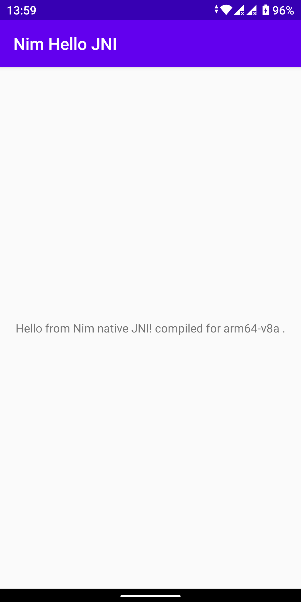

Nim Hello JNI
=============
# 介绍
Nim Hello JNI 是一个使用JNI从安卓JAVA界面调用C代码的例子，C代码是使用Nim编程语言生成的而不是直接从C源码文件。

这个项目从这里改编：[sample hello-jni android project](https://github.com/android/ndk-samples/tree/master/hello-jni) bye by translating the C file, NimHelloJNI/app/src/main/cpp/hello-jni.c to a Nim source file, NimHelloJNI/app/src/main/cpp/hello-jni.nim.

这个更改添加了需要的.nim文件，添加了 nim 构建脚本文件 (.cmd for windows and sh for linux), 使用 s`ndk-build` 而不是 `Android.mk` 文件
# 注意
值得注意的发现是，nimbase. h文件需要在本地构建过程中可用，并且在对Nim字符串进行任何操作之前需要调用NimMain，因为Android和Nim的垃圾收集（GC）和内存管理系统会发生冲突（除非使用一些替代的GC，但最好的GC仍在开发中，并不推荐使用；使用 --gc: none会导致内存泄漏，如果在创建cstring时没有大量的额外复杂性的话）；这些问题在Nim文档和Nim论坛的不同地方都有记录，但这是唯一一个把所有东西都集中在一起的地方。 此外，由于Nim产生的.c文件是针对cpu架构的硬编码，我们为每个cpu使用单独的目录，并使构建系统根据当前的构建架构选择正确的目录。 此外，运行NimMain`proc`的最巧妙的方法是在JNI_OnLoad例程中运行它，这样当动态库文件被加载时，它就会自动运行一次。

# 原理
在这里使用的构建系统中，Nim只被用来（`-c`）编译成.c文件，并让构建系统将这些文件变成共享库文件，这似乎比使用Nim全部编译成共享动态库来被构建系统作为第三方库包含要简单一些，尽管这样做也可以，并且可以消除对构建文件系统中`nimbase.h`文件的需要。

前提条件
--------------
- Android Studio 2.2+ with [NDK](https://developer.android.com/ndk/) bundle.

准备开始
---------------
1. [安装Nim](https://nim-lang.org/install.html) 
3. [下载 Android Studio](https://developer.android.com/sdk/index.html)
4. Install Android Studio as per the instructions.
5. 启动 Android Studio.
6. 打开 *Tools>SDK Manager* 并且确保 Android 12.0 (S) SDK Platform, version 31.0.0 SDK Build tools 和 NDK (Side by side latest sub version of 23) 被安装
7. 下载这个仓库为zip文件或者克隆这个仓库
8. 用 Android Studio 打开这个工程
9. 注意 "nimbase.h" 和 "comping.txt" 文件需要同步你当前机器上正在使用的版本，它们在 "app/main/src/cpp" 目录和Nim的lib目录和Nim的根目录 (此仓库使用1.6.6版本的Nim)
10. 从 Android Studio 终端运行 "buildnim.cmd" (for Windows) 或者 "buildnim.sh" (for Linux/OSX) 来编译Nim文件到C文件
11. 点击 *Files>Sync Project with Gradle Files*.
12. 点击 *Run/Run 'app'*.
13. 你可以使用 "Build>Generate Signed Bundle/APK..." 来生成apk文件

这里有一个已经编译好的apk文件在 `app/release` 目录
截图
-----------

License
-------
Copyright (C) 2020 W. Gordon Goodsman (GordonBGood). All rights reserved.

Permission is hereby granted, free of charge, to any person obtaining a copy
of this software and associated documentation files (the "Software"), to deal
in the Software without restriction, including without limitation the rights
to use, copy, modify, merge, publish, distribute, sublicense, and/or sell
copies of the Software, and to permit persons to whom the Software is
furnished to do so, subject to the following conditions:

The above copyright notice and this permission notice shall be included in
all copies or substantial portions of the Software.

THE SOFTWARE IS PROVIDED "AS IS", WITHOUT WARRANTY OF ANY KIND, EXPRESS OR
IMPLIED, INCLUDING BUT NOT LIMITED TO THE WARRANTIES OF MERCHANTABILITY,
FITNESS FOR A PARTICULAR PURPOSE AND NONINFRINGEMENT. IN NO EVENT SHALL THE
AUTHORS OR COPYRIGHT HOLDERS BE LIABLE FOR ANY CLAIM, DAMAGES OR OTHER
LIABILITY, WHETHER IN AN ACTION OF CONTRACT, TORT OR OTHERWISE, ARISING FROM,
OUT OF OR IN CONNECTION WITH THE SOFTWARE OR THE USE OR OTHER DEALINGS IN
THE SOFTWARE.

[ MIT license: http://www.opensource.org/licenses/mit-license.php ]
